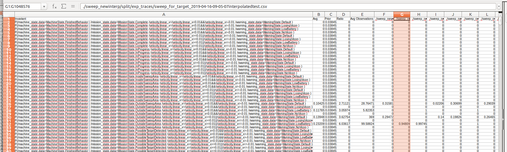

# Probabilistic Conditional System Invariant Generation with Bayesian Inference

> Invariants are a set of properties over program attributes that are expected to be true during the execution of a program. Since developing those invariants manually can be costly and challenging, there are a myriad of approaches that support automated mining of likely invariants from sources such as program traces. Existing approaches, however, are not equipped to capture the rich states that condition the behavior of autonomous mobile robots, or to manage the uncertainty associated with many variables in these systems. This means that valuable invariants that appear only under specific states remain uncovered. In this work we introduce an approach to infer conditional probabilistic invariants to assist in the characterization of the behavior of such rich stateful, stochastic systems. These probabilistic invariants can encode a family of conditional patterns, are generated using Bayesian inference to leverage observed trace data against priors gleaned from previous experience and expert knowledge, and are ranked based on their surprise value and information content. Our studies on two semi-autonomous mobile robotic systems show how the proposed approach is able to generate valuable and previously hidden stateful invariants.  

## In this Repo

This repo contains the inference engine, datasets and priors and configuration files to produce invariants for two different case studies as elucidated in [this paper under submission](paper.pdf).

## Steps to run

### 1. Clone the repo.

To clone from an anonymized GitHub:
```
git clone https://github.com/Anon06160006/inference-engine
```

Or, to clone from anonymous.4open.science, install Python 3, update SSL certificates, and run: 
```
pip install beautifulsoup4
pip install lxml
git clone https://github.com/MissMeriel/clone-anonymous4open.git
cd clone-anonymous4open
python3 clone.py --clone-dir /path/to/save  --target https://anonymous.4open.science/r/838f6ec4-c4c4-4ce7-a7c4-8910c3a73e66/
```
Note that this may take 15+ minutes and that binaries and pdfs will not be fetched.

### 2. Download dependencies to ./tool_src/:
The following dependencies are provided and already reside in tool_src/:
- commons-lang3-3.9/
- com.google.guava_1.6.0.jar
- commons-math3-3.6.1/
- java-cup-11a.jar
- org.apache.commons.lang3

Install python dependencies:
```
pip install matplotlib numpy
```

Note that python scripts are written in Python2. If your system uses python3, run
```
cd tool_src/; ./py3.sh
```

### 3. Unzip trace archives.
```
unzip study_1/drone_traces/drone_traces.zip -d study_1/drone_traces/
unzip study_2/subjecttraces/subjecttraces.zip -d study_2/subjecttraces/
```

### 4. Compile everything:
Use the makefile in ./tool_src/ dir.
```
make all
```
OR....

To compile engine on its own:
```
javac -classpath .:./commons-lang3-3.9/*:./com.google.guava_1.6.0.jar:commons-math3-3.6.1/*:./java-cup-11a.jar inference_engine/*.java
```
To compile assistant scripts:

```
javac Probability_To_Csv.java
```

### 5. Run scripts
```
cd study_1/
./generate_bag_probabilities.sh      # drone invariants
cd study_2/
./generate_driving_probabilities.sh  # driving invariants
```

### Collecting and Interpreting Output

Study 1 (drone study) outputs one artifact:  drone_outfilehoriz.csv. The .csv contains a horizontally formatted compendium of invariants sorted by outcome. Columns are: 
- **Invariant**: the conditional invariant of the form P( Outcome | Given1 Given2...)
- **Avg**: the probability of the invariant averaged over all traces
- **Prior**: the most up to date prior that was used to calculate invariant probability
- **Ratio**: surprise ratio of posterior over prior
- **Avg Observations**: number of observations of Outcome && Givens averaged over all traces
These columns are then followed by trace1,trace2,... which contain the probability of that invariant for each trace.
Output will appear in a csv file: 

Study 2 (driving study) outputs two artifacts: driving_outfilehoriz.csv and a graph. The .csv follows the same format as that for the drone study. The graph shows the variance of surprise between prior and posterior from run to run of several invariants whose surprise shows a high variance from run to run.
A sample of the graph output is shown below plotting variance of surprise ratio as more traces are consumed with each iteration: 

### FAQ
To run engine on a particular trace:
```
java -classpath .:./commons-lang3-3.9/*:./com.google.guava_1.6.0.jar:commons-math3-3.6.1/*:./java-cup-11a-runtime.jar inference_engine.Driver example.csv  example.config
```

For help:
```
java -classpath .:./commons-lang3-3.9/* Driver -h
```
